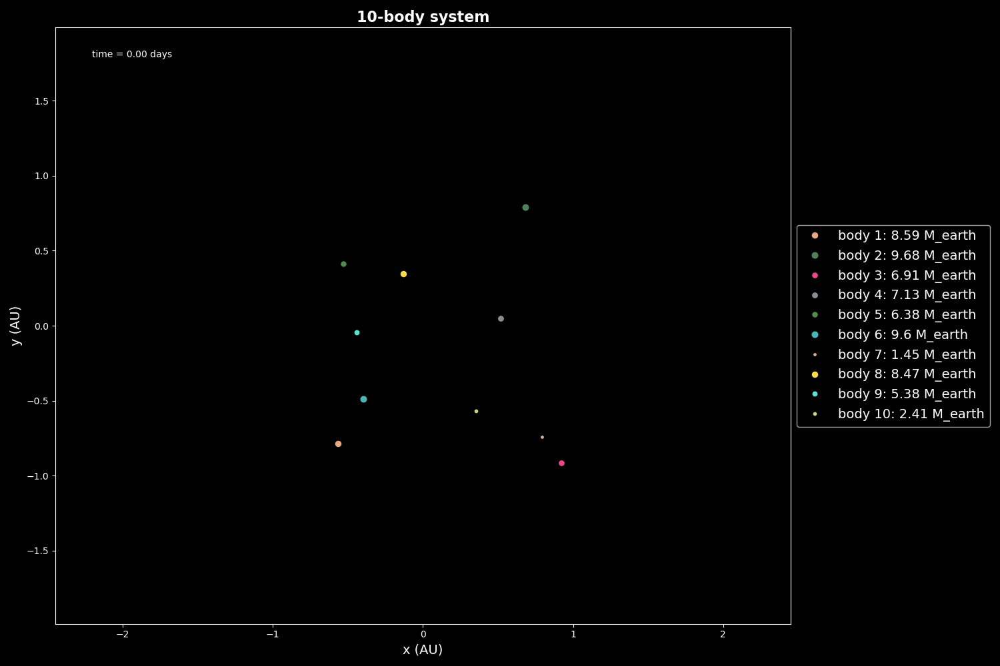

# Simulation of the n-body problem in 2 and 3 dimensions

Project that integrates the n-body problem in 2D or 3D. A web version of this project is still in progress.

The project is written in C and Python. The C code runs the rk78 integrator and the Python code is used to plot the results.

(Inspired by a project of https://github.com/daniellozanojarque)

### Requirements

- `gcc` compiler
- `make` tool
- `python3`

And the following Python libraries

- `matplotlib`
- `numpy`
- `pandas`
- `ctypes`

### Installation and execution of the project

Copy the following code to your terminal in order to download the project.

```
git clone git@github.com:victorballester7/n-body_problem.git
cd n-body_problem
chmod +x execute.sh
```

To execute the project, run the following command:

```
./execute.sh
```

### Some animations

We present here some animations of the project in 2D and 3D.

#### 2D


<div style="display: flex;" align="center">
  <div style="flex: 45%; padding: 5px;">
    
    <p>Random system of 10 bodies in 2D</p>
  </div>
  <!-- <div style="flex: 45%; padding: 5px;">
    <video width="100%" controls>
      <source src="../animation/solar_system2d.mp4" type="video/mp4">
      Your browser does not support the video tag.
    </video>
    <p>Solar system</p>
  </div> -->
</div>

#### 3D

<!-- <div style="display: flex;" align="center">
  <div style="flex: 45%; padding: 5px;">
    <video width="100%" controls>
      <source src="video_filename.mp4" type="video/mp4">
      Your browser does not support the video tag.
    </video>
    <p>Random system of 20 bodies in 3D</p>
  </div>
  <div style="flex: 45%; padding: 5px;">
    <video width="100%" controls>
      <source src="video_filename_2.mp4" type="video/mp4">
      Your browser does not support the video tag.
    </video>
    <p>Rocky planets of the Solar System</p>
  </div>
</div> -->
